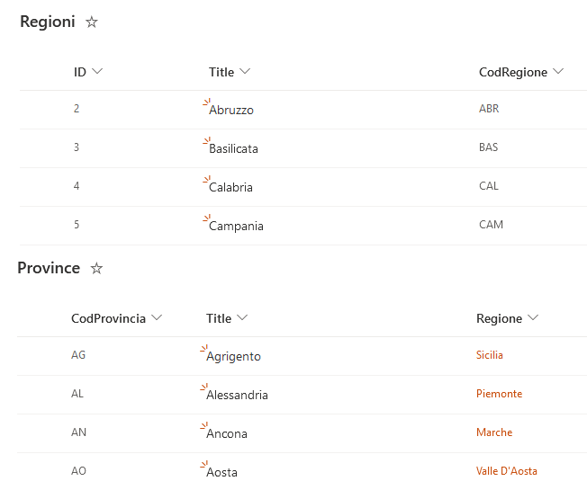
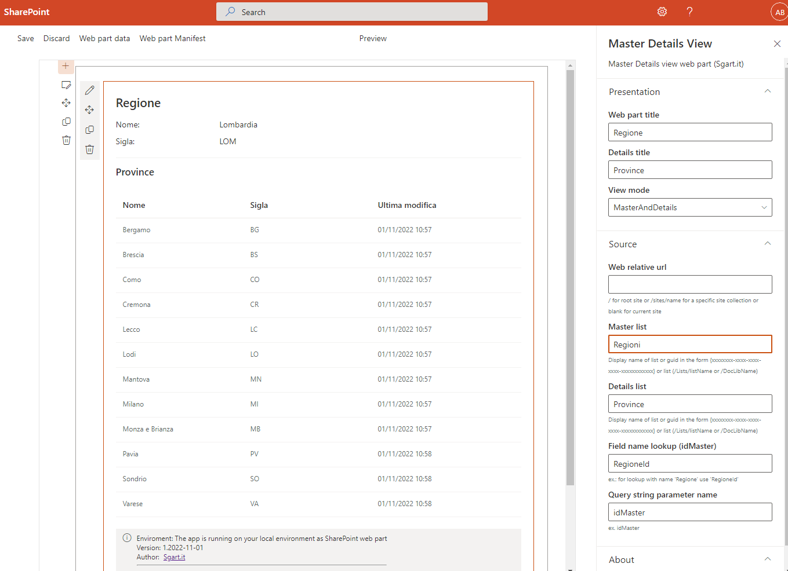

# sgart-spfx-master-details-view-webpart

SPFx base template for master details view (beta)

## Summary

Read parameter from querystring (ex. idMaster=10) and reader master and details information from SharePoint lists

## install project

yo @microsoft/sharepoint

node v. 16.x

SPFX v. 1.15

npm install gulp-cli yo @microsoft/generator-sharepoint --global

gulp trust-dev-cert

## Debug

gulp serve

usare chrome all'indirizzo https://NomeTenant.sharepoint.com/_layouts/15/workbench.aspx?idMaster=10

passare in querystring l'id della testata da visualizzare

con firefox Warning:

Your web part will not appear in the toolbox. Please make sure "gulp serve" is running in a web part project. Please refresh the page once "gulp serve" is running.
Click here for more information.

## Dati di esempio

Per testare l'esempio creare 2 liste SharePoint 

### Regioni

- Title (Single line of text)
- CodRegione (Single line of text)

### Province

- Title (Single line of text)
- CodProvincia (Single line of text)
- Regione (lookup to Regioni)

## Screenshot

## Links

[Fluent UI - Controls](https://developer.microsoft.com/en-us/fluentui#/controls/web)
